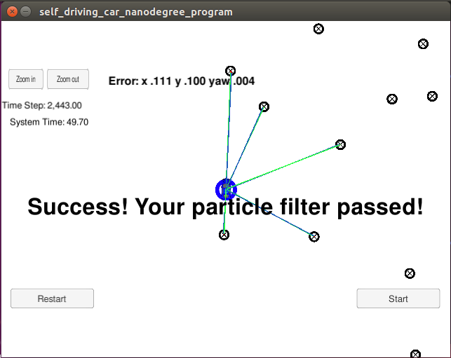
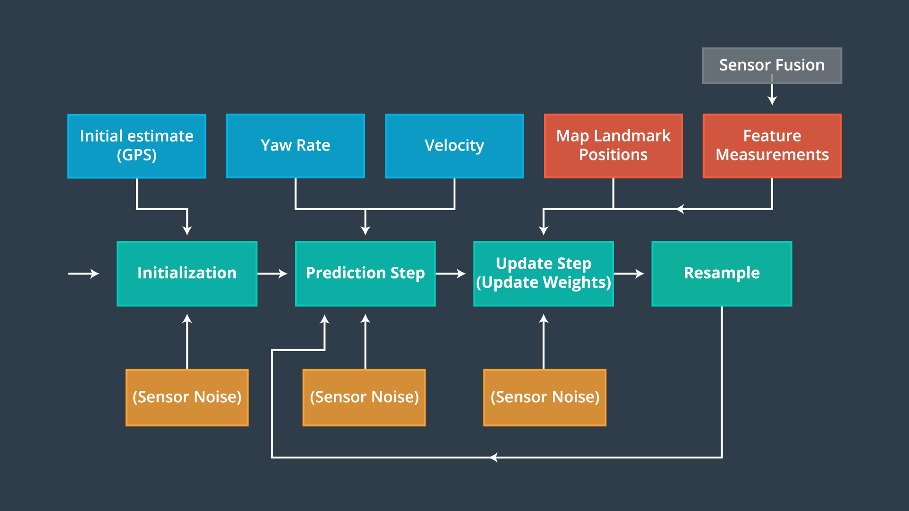

# Particle Filter Project Starter Code
Self-Driving Car Engineer Nanodegree Program

In this project I will utilize a Particle Filter to locate the vehicle in the simulator. 

The goals / steps of this project are the following:

* 1.Your code should compile.
* 2.Does your particle filter localize the vehicle to within the desired accuracy?
* 3.Does your particle run within the specified time of 100 seconds?
* 4.Does your code use a particle filter to localize the robot?


### [Rubric](https://review.udacity.com/#!/rubrics/747/view) Points
### Here I will consider the rubric points individually and describe how I addressed each point in my implementation.  

#### 1.Your code should compile.
I compile project by following instructions:

1. ./clean.sh
2. ./build.sh
3. ./run.sh


#### 2.Does your particle filter localize the vehicle to within the desired accuracy?
The simulator says "Success! Your particle filter passed!" .
<div class="test">

</div>


#### 3.Does your particle run within the specified time of 100 seconds?
The particle runs in 50 seconds

#### 4.Does your code use a particle filter to localize the robot?
Here is a framework from course:
<div class="test">

</div>


Here is a code fragment about the particle filter:
```

        void init(double x, double y, double theta, double std[]){
        	...
        }

        void prediction(double delta_t, double std_pos[], double velocity, double yaw_rate){
        	...
        }

        void updateWeights(double sensor_range, double std_landmark[], 
                        const std::vector<LandmarkObs> &observations,
                        const Map &map_landmarks){
          ...
        }

        void resample(){
          ...
        }

```
